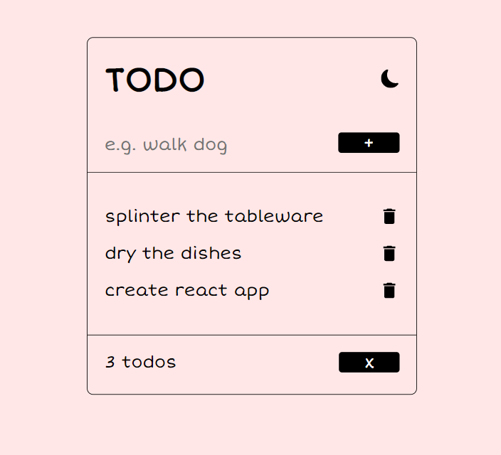

# ToDo App

This repository contains code for a Todo app
<i>[Click here to view the app](https://todo-ni.netlify.app/)</i>

## About the app

ToDo is an app that allows you to add, delete and clear all the things you plan to do.
You can also change the theme of the application

## Built with

- HTML
- CSS
- React.js

## Authors

Nigel Nkomo

## Study Notes

  

  
### Browser Session
* a **browser session** is the mechanism for **recognising** multiple **requests** from the **same** browser
* it starts when the browser is opened and stops when the browser is shut down

### Origin

- the origin is the **scheme/host/port tuple** of a URL ,e.g. , http://example.com:80 or http://localhost:3000 used to access it
- the **scheme** is the **protocol** ,e.g. , http
- the **host** is the **hostname** or the **domain** ,e.g. , example.com
- the **port**(if specified) is the **communication endpoint**, e.g. , 80 (the default for http) or 443 (the default for https)
- two URLs have the same origin if all they have the same tuple

### localStorage data

- localStorage allows you to **access** and **manipulate** the **Storage object** of the _Document's_ **origin**
- localStorage data is saved **across** browser sessions, i.e. , it doesn't get cleared when the page is closed
- However localStorage data for a document opened in **'private browsing'** or **'incognito'** gets **cleared** when the **tab is closed**
- the **Document** object represents the any web page and the **documentElement** is the **root element**
- localStorage data is **specific** to the **protocol/scheme** of the **document**, i.e. , it is different for *http://example.com* and \*https://example.com**, and returns a different object

#### methods:

1. **setItem ( keyName, keyValue )** adds the key's name and value or updates them
2. **getItem ( keyName )** returns keyValue
3. **removeItem ( keyName )** removes the key from the Storage object if it exists
4. **clear ( )** removes all the data in the localStorage object
